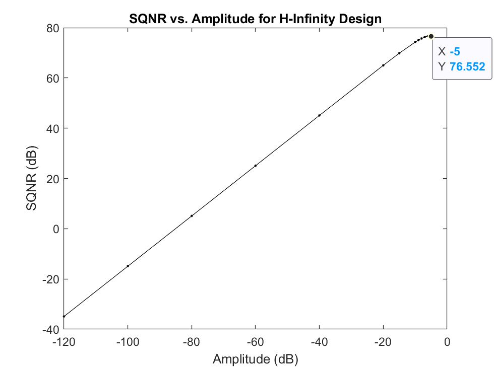

# sdm-opt
Code for designing sigma delta modulator loop filters with optimal properties. Developed during my masters thesis research at the [Digital Health Innovation Lab](https://bcchr.ca/dhil).

## Requirements
- MATLAB (tested in versions 2018a-2022a)
- [YALMIP](https://yalmip.github.io/) 
- [Delta Sigma Toolbox](https://www.mathworks.com/matlabcentral/fileexchange/19-delta-sigma-toolbox)
- Optimization solver such as [Mosek](https://www.mosek.com/) or [Sedumi](https://sedumi.ie.lehigh.edu/) (optional, the built-in LMILAB seems to work better for this problem)

## Getting Started

This repository includes the main function [`sdsyn.m`](sdsyn/sdsyn.m), its dependencies, as well as a large amount of other code developed during the thesis. Much of this is not well documented and was used for testing ideas. However, there are some robust control synthesis functions that may be useful in the `\Control` subfolder.

The process of designing a loop filter has the following steps:

1. Define the optimization constraints for performance and stability. This is described at length in [1].
2. Obtain an initial starting condition loop filter. The optimization is quite sensitive to initial conditions so it is recommended to have a good initial guess.
3. Run the `sdsyn.m` function.

## Reproducing Examples from the Thesis and Paper

### H-Inifinity Optimal Design (Lee Criterion)

First, define the optimization objectives using the `defineSynOpt.m` function. This function takes in five parameters per objective:

1. Target value of the norm (`-1` to minimize, `Inf` to not optimize).
2. Norm (`1` for $\ell_1$, `2` for $\mathcal{H}_2$, or `Inf` for $\mathcal{H}_\infty$).
3. Frequency interval, as a 2-element vector for the digital frequency range to be optimized (`[0 pi]` to span the entire frequency range, otherwise GKYP lemma used to optimize over a finite frequency interval).
4. Input channel, an index to select which generalized plant disturbance input should be optimized.
5. Output channel, an index to select which generalized plant performance output channel should be optimized

The channels for 4. and 5. are summarized in this table, adapted from Table 2.1 in [1]. See also the function `sdsyn_buildplant` in `sdsyn.m`, line 638.

| I\O    | 1. `z` | 2. `e` | 3. `u` | 4. `y` |
|--------|--------|--------|--------|--------|
| 1. `w` | Quantizer gain robustness | Not used | Not used | Not used |
| 2. `r` | Not used                  | NTF performance | Constraints on quantizer input | STF constraints for CT design |

The optimization objectives for the H-Infinity case are defined as such:

    synOpt_51 = defineSynOpt(-1, Inf, [0 pi/32], 2, 2, 1.5, Inf, [0 pi], 2, 2);

Next, an initial guess of the loop filter is required. For this, it is convenient to use the popular `synthesizeNTF` command of the Delta Sigma Toolbox.

    S0 = synthesizeNTF(5, 32, 1, 0.5, 0);

`synthesizeNTF` produces a NTF, which must be converted into loop filter form following Equation 1.3 from [1]. The poles must also be slightly scaled so that the loop filter is strictly stable, otherwise `sdsyn.m` will produce an error.

    H0 = zpk(minreal((1 - S0)/S0));
    H0.p{1} = H0.p{1}*0.995;

The main `sdsyn` function may now be run:

    [H, S, CL, normz, diagn, iterProgress] = sdsyn(H0, synOpt_51, 'display', 'on');

Once the optimization is complete, the NTF may be evaluated using the `predictSNR` function from the Delta Sigma Toolbox.

    [snr, amp] = predictSNR(S, 32);
    figure; 
    plot(amp, snr, '.-k')
    title('SQNR vs. Amplitude for H-Infinity Design')
    xlabel('Amplitude (dB)')
    ylabel('SQNR (dB)')

The result is a modulator stable to about -5 dBFS and with SQNR of 77 dB. Results are often dependent on inital condition and choice of optimization hyperparameters, such as those on line 195 of `sdsyn.m`.

This example and others may be seen in the file [`sdsyn_examples.m`](sdsyn/sdsyn_examples.m).

## More Information

> [1] B. C. Hannigan, "On the Design of Stable, High Performance Sigma Delta Modulators", MASc. thesis, University of British Columbia, 2018.

> [2] B. C. Hannigan, C. L. Petersen, A. M. Mallinson, and G. A. Dumont, "An Optimization Framework for the Design of Noise Shaping Loop Filters with Improved Stability Properties", Circuits, Systems, and Signal Processing, vol. 39, no. 12, pp. 6276–6298, 2020.
